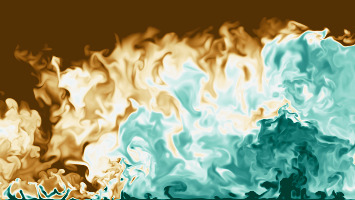

Using 1 km and 1 m s−1 as characteristic length and velocity scales of the large energy-containing motions in the planetary boundary layer, one finds a Reynolds number on the order of 108 and a length-scale separation between the large energy-containing motions and the small dissipative ones of about 6 orders of magnitude. Under these conditions, one commonly assumes that the small scales are approximately homogeneous and isotropic. However, is this assumption appropriate?

The planetary boundary layer is statistically inhomogeneous in the vertical direction, and there is no clear separation between the dynamics near the surface and the dynamics near the boundary-layer top. Besides, stratification and large-coherent motions introduce energy at characteristic scales that are significantly smaller than 1 km. Hence, understanding to what extent we can describe turbulence as homogeneous and isotropic on scales of meters and less is important to model turbulence effects in the Earth system. In particular, implications are important for cloud formation and chemical reactions, where small scales play a decisive role.

We articulate our research on atmospheric turbulence with the following research questions:

* How homogeneous and isotropic is turbulence near the boundary-layer top?
* How does external intermittency affect turbulence properties there?
* How do large-scale coherent motions affect intermediate and small scales in the bulk of the planetary boundary layer?
* How do large-scale coherent motions affect intermediate and small scales near the surface?
* How important are these deviations from homogeneous isotropic turbulent for cloud microphysics?
* How important are these deviations from homogeneous isotropic turbulent for atmospheric chemistry?
