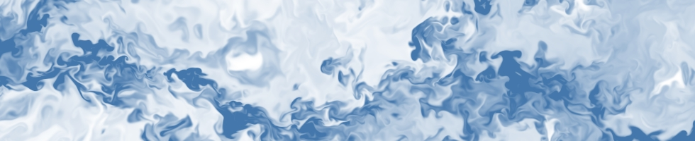

Clouds constitute disperse and dilute multi-phase turbulent flows in which the suspended particles are liquid droplets and ice crystals, and the carrier gas is a mixture of dry air and water vapor, water undergoing phase transition. Turbulent multiphase flows constitute an area of active research by themselves. In the earth system, the problem is even more complex because of the link to radiative transfer, hydrological cycles, and aerosol transport. Clouds is one of the most important topics to be addressed in the coming years, since they are a major source of uncertainty in climate and weather prediction.

In our group we aim at the first part of the problem, namely, at the description and analysis of small-scale processes associated with turbulent multi-phase flows and the simulation of them. The focus is on how to extend current continuum formulations of the system to incorporate part of the complex phenomena associated with phase transition and inertial effects, on the limitations of it as well as possible alternatives.

We articulate our research on clouds with the following research questions:

* How do turbulence, stratification, latent heat, radiative transfer and microphysics interact at cloud boundaries?
* How does the relative importance of those interactions depend on the environmental conditions?
* What is the relative importance of large scales and small scales in those interactions?
* How can we use direct numerical simulations as reference for large-eddy simulations?
* How can we represent those interactions in mixed-layer models?
