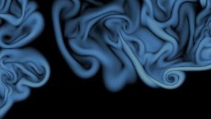

---
# Feel free to add content and custom Front Matter to this file.
# To modify the layout, see https://jekyllrb.com/docs/themes/#overriding-theme-defaults

layout: home
---

<!-- Atmospheric dynamics compound very diverse multi-scale complex phenomena, from synoptic-scale motions to small-scale turbulence interlinked through chemistry, radiation and clouds. Turbulence is the focus of this Max Planck Research Group. Our goal is to improve our current understanding of geophysical turbulence and its role in the susceptibility of the earth system. The tools that we use are theory and simulations. -->

Turbulence enhances mixing--drastically. Sometimes, a simple model of that is all we need for engineering and geophysical applications, and we can ignore the small-scale details. Some other times, however, the small-scale details control the large-scale behavior and the multi-scale nature of turbulence fully unfolds, challenging all efforts to describe it in simple ways. This is where supercomputing comes into play. Supercomputing has given us the opportunity to study turbulence with unprecedented accuracy and to address pressing issues in climate and technology. This is the story of this project.

<!-- and thereby to advance turbulence modeling to what is necessary for the societal demands during the coming decades. -->

<!-- We are interested in these cases. In order to faithfully resolve the small-scale turbulence that is relevant in these cases, we use direct numerical simulation, which has become feasible only in recent years thanks to the progress in supercomputing. -->

<!-- Our research currently focuses on clouds and planetary boundary layers. -->
