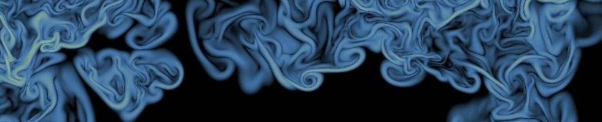

---
# Feel free to add content and custom Front Matter to this file.
# To modify the layout, see https://jekyllrb.com/docs/themes/#overriding-theme-defaults

layout: home
---

<!-- Atmospheric dynamics compound very diverse multi-scale complex phenomena, from synoptic-scale motions to small-scale turbulence interlinked through chemistry, radiation and clouds. Turbulence is the focus of this Max Planck Research Group. Our goal is to improve our current understanding of geophysical turbulence and its role in the susceptibility of the earth system. The tools that we use are theory and simulations. -->

Turbulence enhances mixing drastically. Sometimes, a simple parametrization of that enhancement is all we need to represent the effect of turbulence in engineering and geophysical flows. Some other times, however, turbulence might act as a controlling process and its details become relevant. We are interested in these cases. In order to faithfully resolve the small-scale turbulence that is relevant in these cases, we use direct numerical simulation, which has become feasible only in recent years thanks to the progress in supercomputing.

<!-- Our research currently focuses on clouds and planetary boundary layers. -->
