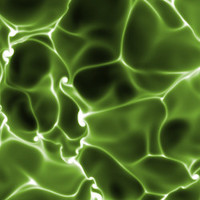
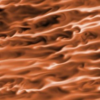

The region of the atmosphere directly affected by the surface extends vertically from a few hundred meters to a couple of kilometers, and it is called the planetary boundary layer or the atmospheric boundary layer. It is typically in a turbulent state. Turbulence can be sustained by the heat transfer from the surface, when cellular patterns like the ones shown next to this text are often observed. The relatively warmer regions organize into ascending layers and transport away the heat that has been transferred from the ground to the air mass that descends in between. In the upper region of the boundary layer, the interaction of turbulent motions and the stable inversion dictates the rate at which free-atmosphere air is entrained into the boundary layer, controlling the boundary layer growth. Although major aspects of this system are well understood, key processes associated with small-scale turbulence at the lower and upper regions of the boundary layer remain a challenge.

Turbulence in the planetary boundary layer can also be sustained by a mean horizontal wind and the resulting strong shear that forms next to the surface. In this situation, the flow structure next to the ground changes notoriously, from the cellular pattern mentioned before to the elongated structures observed in the second image. How do shear driven turbulence and buoyancy interact? Both convectively unstable and stable conditions pose interesting questions and are relevant for society, whether it is wind energy or air quality in the cities. The interaction of this turbulent flow with a stable background stratification, however, is particularly challenging. As the surface cools down, the turbulent kinetic energy diminishes because of the increasingly heavier parcels of fluid that are transported upwards. A point might be reached in which turbulent mixing is inhibited in an intermittent way, modifying the cooling rates of the surface. This is another problem that attracts considerable attention of the scientific community and we are currently exploring new ways to study it and represent it in models.

We articulate our research on planetary boundary layers with the following research questions:

* How do entrainment-zone properties depend on the interaction between shear and convection?
* How does this interaction depend on the environmental conditions?
* How can we represent entrainment-zone properties in simple atmospheric models?
* What are the corresponding moisture properties?
* How do large-scale motions influence near-surface properties?
